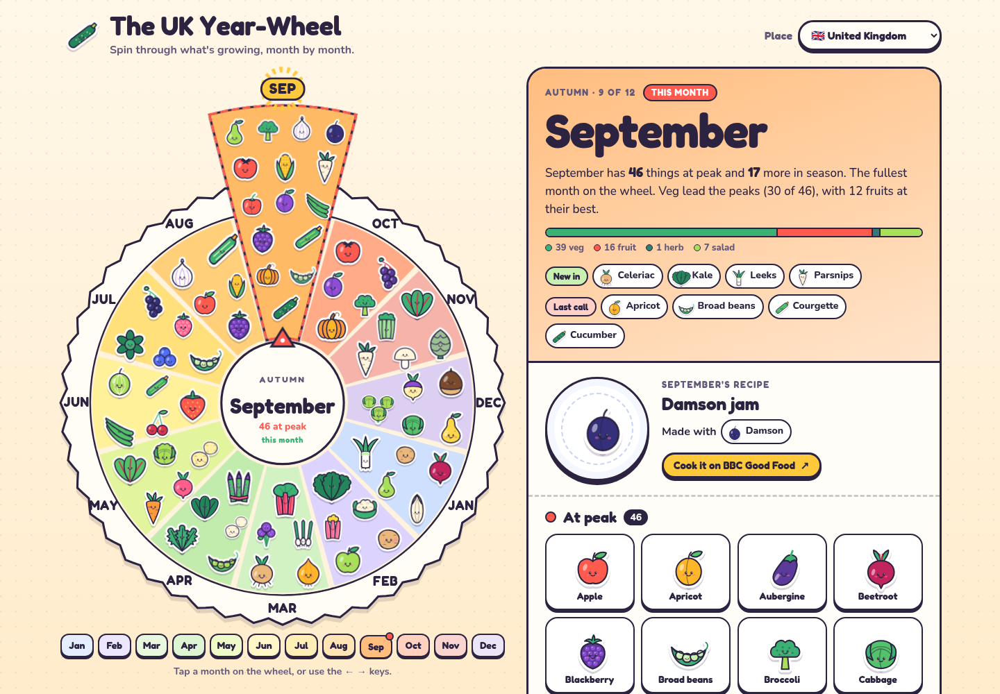

# Seasonal Produce

An illustrated year-wheel of what fruit and veg are in season, month by month, across 13 places. Spin the wheel, tap a month to see what's at its peak, and tap any sticker for a fact sheet. It lives at **[qingsworkshop.com/in-season](https://www.qingsworkshop.com/in-season/)**, part of Qing's Workshop.

[](https://www.qingsworkshop.com/in-season/)

## Places

Pick a place from the **Place** menu, or link straight to one with `?country=<id>`.

| Region | Place | Id |
| --- | --- | --- |
| Europe | United Kingdom | `uk` |
| Europe | France | `fr` |
| Europe | Spain | `es` |
| Europe | Italy | `it` |
| North America | Ontario | `on` |
| North America | Florida | `fl` |
| Asia | Sichuan | `sc` |
| Asia | Shandong | `sd` |
| Asia | Jiangsu | `js` |
| Asia | Yunnan | `yn` |
| Asia | Hainan | `hi` |
| Asia | Xinjiang | `xj` |
| Asia | Japan | `jp` |

Regional places stay regional. Ontario is not Canada, Florida is not the United States, and each Chinese province is its own wheel. Any id not in this table, such as `us` or `cn`, falls back to the UK.

## What "in season" means

Here, "in season" means **grown locally in that place during that month**. What the shops happen to import does not count. A lemon on a London shelf in February is not a UK crop, so it isn't on the UK wheel.

Where the sources allow, each month sorts its produce into **at peak**, **in season**, and **on the edge** (the start or end of a season, or a month only one source mentions). The UK wheel also has a recipe for every month.

## Run it locally

It's a static site with no dependencies. You only need Node (CI uses Node 22) and Python 3.

```bash
node scripts/build-data.mjs     # rebuild site/data/ from the packs in data/
node scripts/check-ship.mjs     # run the acceptance checks
python3 -m http.server -d site  # serve at http://localhost:8000/
```

By default the wheel opens on the current month in the place's own timezone. You can change that with URL parameters:

| Parameter | Example | Effect |
| --- | --- | --- |
| `country` | `?country=jp` | Open a place by id (see the table above). Unknown ids fall back to `uk`. |
| `month` | `?month=9` | Open a month, `1`–`12`. |
| `item` | `?item=apple` | Open that item's fact sheet once the wheel stops spinning. Use the item's name as it appears in the pack. |

You can combine them, as in `?country=fr&month=6`. The same parameters work on the [live site](https://www.qingsworkshop.com/in-season/?country=jp).

## How the data is laid out

- **`data/<id>/`** holds one pack per place. `pack.json` has the name, timezone, month names and source attribution. `produce_calendar.csv` has the month-by-month grid. `copy.json` has the interface wording, `staples.txt` the commonness ranking for stickers, and `schema_and_evidence_rules.md` explains how that pack's months were decided.
- **`art/`** draws the stickers. `art/draw.mjs` makes the shared sticker art, and `art/bindings/<id>.json` maps each item in a pack to a sticker.
- **`scripts/build-data.mjs`** reads every pack and regenerates `site/data/<id>.json`, `site/data/registry.json`, `site/sprites.svg` and `site/og.svg`. Don't edit those by hand. CI rebuilds them and fails if the committed copies are stale.
- **`site/`** is the page itself: `index.html`, `exhibit.js`, `styles.css` and self-hosted fonts. The [Workshop site](https://www.qingsworkshop.com/in-season/) serves a copy of this folder.

### Adding a place

1. Create `data/<id>/` with the same files as an existing pack, and `art/bindings/<id>.json` for its stickers.
2. Add the id to `PACK_ORDER` in `scripts/build-data.mjs` so it sorts into the registry where you want it.
3. In `site/exhibit.js`, add the id to `PLACE_FLAGS` and to its group in `PLACE_CONTINENTS`. A place missing from `PLACE_CONTINENTS` won't show up in the Place menu.
4. Update the expected id lists in `scripts/check-ship.mjs`.
5. Run `node scripts/build-data.mjs` and `node scripts/check-ship.mjs`, then commit the regenerated `site/` files.

Only count what's grown there. Leave out import-only produce instead of hiding it.

## Sources

Every pack credits the public sources behind it. You'll find the credit in the `attribution` field of `data/<id>/pack.json`, which the page also shows in its footer. Each pack's `schema_and_evidence_rules.md` gives more detail, and Spain adds a source ledger in `data/es/primary_sources.csv`.

## Design notes

For the curious:

- [INTENT.md](INTENT.md): what the wheel set out to do.
- [DESIGN.md](DESIGN.md): the "sticker garden" art direction, wheel anatomy and motion.
- [ARCH.md](ARCH.md): how one shared wheel renders any place's pack.
- [`prototype/`](prototype/): the original design prototype, kept for comparison. Serve it with `python3 -m http.server -d prototype`.

## Made with

Designed and built with AI models in [Cursor](https://cursor.com): Claude Opus 5.5 designed the UI and built the prototype, and Grok did the architecture and implementation. Art direction and product decisions by Qing.

## License

The code is [MIT](LICENSE), copyright 2026 Yanqing Cheng / Qing's Workshop. Pack source attributions stay with their named public sources.
